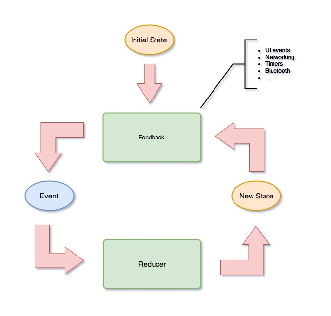
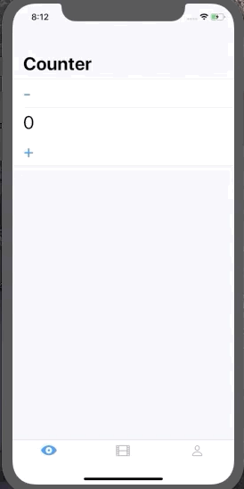
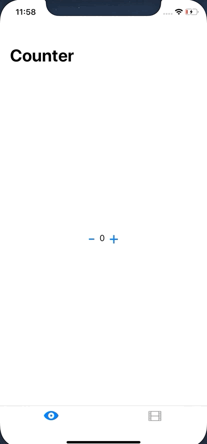
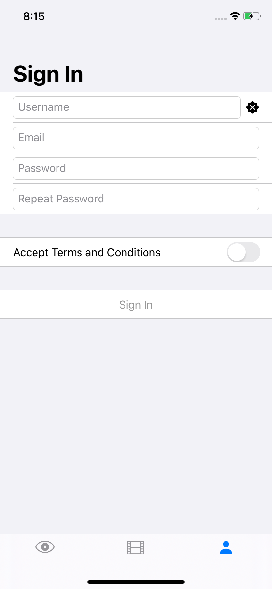

# CombineFeedback

Unidirectional Reactive Architecture. This is a [Combine](https://developer.apple.com/documentation/combine) implemetation of [ReactiveFeedbback](https://github.com/Babylonpartners/ReactiveFeedback) and [RxFeedback](https://github.com/kzaher/RxFeedback)

## Diagram



## Motivation

Requirements for iOS apps have become huge. Our code has to manage a lot of state e.g. server responses, cached data, UI state, routing etc. Some may say that Reactive Programming can help us a lot but, in the wrong hands, it can do even more harm to your code base.

The goal of this library is to provide a simple and intuitive approach to designing reactive state machines.

## Core Concepts

### State 

`State` is the single source of truth. It represents a state of your system and is usually a plain Swift type. Your state is immutable. The only way to transition from one `State` to another is to emit an `Event`.

### Event

Represents all possible events that can happen in your system which can cause a transition to a new `State`.

### Reducer 

A Reducer is a pure function with a signature of `(State, Event) -> State`. While `Event` represents an action that results in a `State` change, it's actually not what _causes_ the change. An `Event` is just that, a representation of the intention to transition from one state to another. What actually causes the `State` to change, the embodiment of the corresponding `Event`, is a Reducer. A Reducer is the only place where a `State` can be changed.

### Feedback

While `State` represents where the system is at a given time, `Event` represents a state change, and a `Reducer` is the pure function that enacts the event causing the state to change, there is not as of yet any type to decide which event should take place given a particular current state. That's the job of the `Feedback`. It's essentially a "processing engine", listening to changes in the current `State` and emitting the corresponding next events to take place. Feedbacks don't directly mutate states. Instead, they only emit events which then cause states to change in reducers.

To some extent it's like reactive [Middleware](https://redux.js.org/advanced/middleware) in [Redux](https://redux.js.org) having a signature of `(AnyPublisher<State, Never>) -> AnyPublisher<Event, Never>` allows us to observe `State` changes and perform some side effects based on its changes e.g if a system is in `loading` state we can start fetching data from network.


### CombineFeedbackUI

CombineFeedbackUI provides several convenience API to deal with state management and SwiftUI.

#### ViewModel

ViewModel - is a base class responsible for initializing a UI state machine. It provides two ways to interact with it. 

- We can start a state machine by observing `var state: AnyPublisher<S, Never>`. 
- We can send input events into it via `public final func send(event: E)`. 

This is useful if we want to mutate our state in response to user input. Let's consider a `Counter` example

```swift
struct State {
    var count = 0
}

enum Event {
    case increment
    case decrement
}
```
When we press **+** button we want the `State` of the system to be incremented by `1`. To do that somewhere in our UI we can do:

```swift
Button(action: {
    viewModel.send(event: .increment)
}) {
    return Text("+").font(.largeTitle)
}
```

Also, we can use the `send(event:)` method to initiate side effects. For example, imagine that we are building an infinite list, and we want to trigger the next batch load when a user reaches the end of the list. 

```swift
enum Event {
    case didLoad(Results)
    case didFail(Error)
    case fetchNext
}

struct State: Builder {
    var batch: Results
    var movies: [Movie]
    var status: Status
}
enum Status {
    case idle
    case loading
    case failed(Error)
}

struct MoviesView: View {
    typealias State = MoviesViewModel.State
    typealias Event = MoviesViewModel.Event
    let context: Context<State, Event>

    var body: some View {
        List {
            ForEach(context.movies.identified(by: \.id)) { movie in
                MovieCell(movie: movie).onAppear {
                // When we reach the end of the list
                // we send `fetchNext` event
                    if self.context.movies.last == movie {
                        self.context.send(event: .fetchNext)
                    }
                }
            }
        }
    }
}
```
When we send `.fetchNext` event, it goes to the `reducer` where we put our system into `.loading`  state, which in response triggers effect in the `whenLoading` feedback, which is reacting to particular state changes

```swift
    private static func reducer(state: State, event: Event) -> State {
        switch event {
        case .didLoad(let batch):
            return state.set(\.batch, batch)
                .set(\.movies, state.movies + batch.results)
                .set(\.status, .idle)
        case .didFail(let error):
            return state.set(\.status, .failed(error))
        case .fetchNext:
            return state
                .set(\.status, .loading)
        }
    }

    private static func whenLoading() -> Feedback<State, Event> {
        return Feedback(effects: { state -> AnyPublisher<Event, Never> in
            guard case .loading = state.status else {
                return Publishers.Empty().eraseToAnyPublisher()
            }
            return URLSession.shared
                .fetchMovies(page: state.batch + 1)
                .map(Event.didLoad)
                .replaceError(replace: Event.didFail)
        })
    }
```

Sometimes tho we are only interested in the particular value of `State ` property to be changed. E.g if we are building a signup form and we just want to change `email` property on the state. We can do something like this

```
struct State  {
        var email = ""
        var password = ""
}

viewModel.mutate(keyPath: \.email, "example@example.com")
```

#### Widget

`Widget<State, Event>` - is a convenience `View` that takes a `ViewModel` and  `render` closure which renders new content every time the `State` changes.


```
Widget(viewModel: SignInViewModel()) { context in
	SignInView(context: context)
}
```

#### Context

`Context<State, Event>` - is a rendering context that we can use to interact with UI and render information. Via  `@dynamicMemberLookup` it has all of the properties of the `State` and several conveniences methods for more seamless integration with SwiftUI. (Credits to [@andersio](https://github.com/andersio))

```
struct State  {
        var email = ""
        var password = ""
}
enum Event {
	case signIn
}
struct SignInView: View {
    private let context: Context<State, Event>
    
    init(context: Context<State, Event>) {
        self.context = context
    }
    
    var body: some View {
        return Form {
            Section {
                TextField(context.binding(for: \.email))
                TextField(context.binding(for: \.password))
                Button(action: context.action(for: .signIn)) {
                    Text("Sign In")
                }
            }
        }
    }
}
```

##### Example

| Counter | Infinite List | SignIn Form
| --- | --- | --- |
| |  | 

