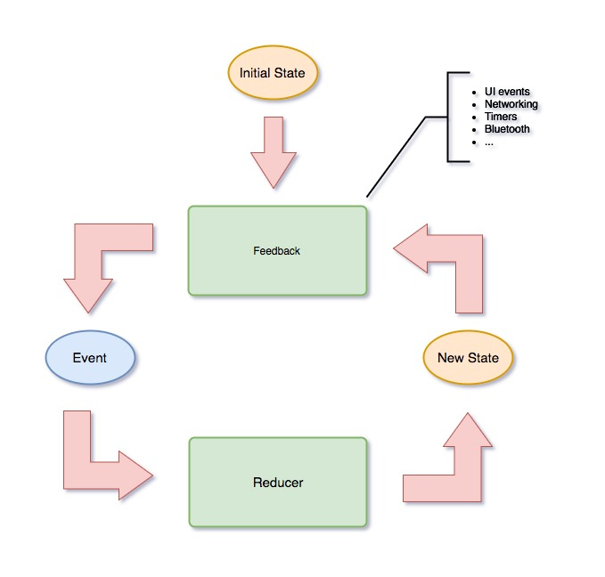
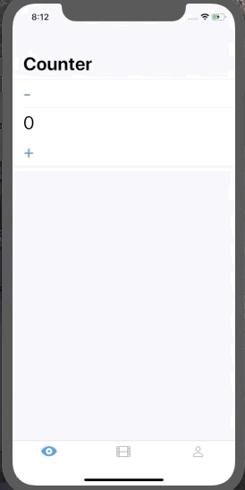
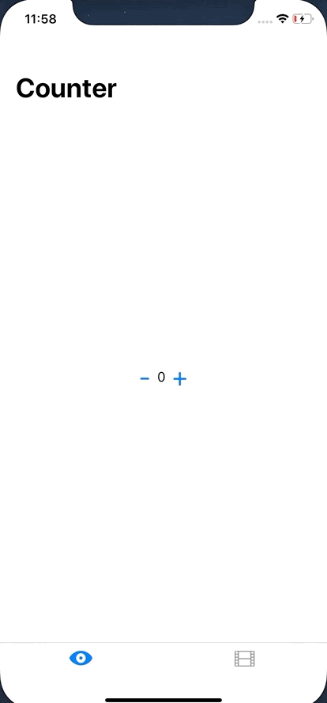
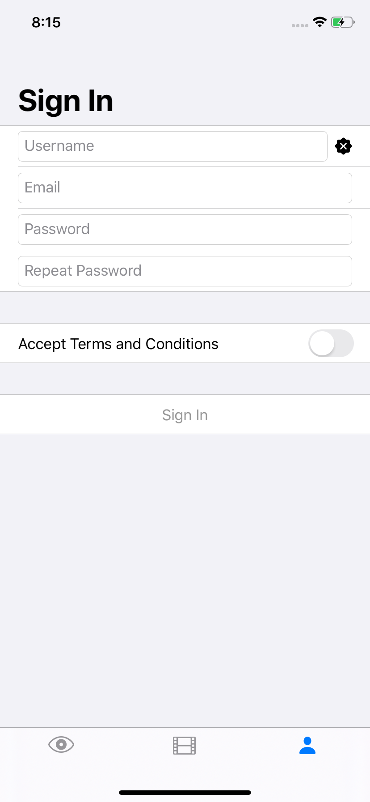
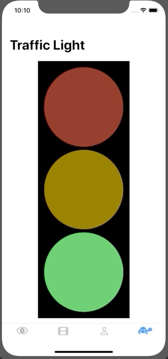

# CombineFeedback

> ⚠️ **Work in progress.** This library is being actively developed and is not yet ready for production or commercial use. The public API is still evolving and may change without notice between versions. It is currently being polished as the sole author's personal project, and breaking changes should be expected until a stable release is announced.

Unidirectional Reactive Architecture. This is a [Combine](https://developer.apple.com/documentation/combine) implemetation of [ReactiveFeedback](https://github.com/Babylonpartners/ReactiveFeedback) and [RxFeedback](https://github.com/kzaher/RxFeedback)

## Diagram



## Motivation

Requirements for iOS apps have become huge. Our code has to manage a lot of state e.g. server responses, cached data, UI state, routing etc. Some may say that Reactive Programming can help us a lot but, in the wrong hands, it can do even more harm to your code base.

The goal of this library is to provide a simple and intuitive approach to designing reactive state machines.

## Core Concepts

### State 

`State` is the single source of truth. It represents a state of your system and is usually a plain Swift type. Your state is immutable. The only way to transition from one `State` to another is to emit an `Event`.

### Event

Represents all possible events that can happen in your system which can cause a transition to a new `State`.

### Reducer 

A Reducer is a pure function with a signature of `( inout State, Event) -> Void`. While `Event` represents an action that results in a `State` change, it's actually not what _causes_ the change. An `Event` is just that, a representation of the intention to transition from one state to another. What actually causes the `State` to change, the embodiment of the corresponding `Event`, is a Reducer. A Reducer is the only place where a `State` can be changed.

### Feedback

While `State` represents where the system is at a given time, `Event` represents a state change, and a `Reducer` is the pure function that enacts the event causing the state to change, there is not as of yet any type to decide which event should take place given a particular current state. That's the job of the `Feedback`. It's essentially a "processing engine", listening to changes in the current `State` and emitting the corresponding next events to take place. Feedbacks don't directly mutate states. Instead, they only emit events which then cause states to change in reducers.

Feedbacks are the effect side of the state machine. Most apps use `OnChange`, `OnEvent`, and `SideEffect`; `Feedback.custom` is available for advanced stream composition.

### StateMachine

A `StateMachine` is the complete behavior of a feature or subsystem. It composes pure transitions and feedback pieces in one ordered body so reducers and effects cannot be accidentally half-wired.

```swift
struct Counter: StateMachine {
    struct State {
        var count = 0
    }

    enum Event {
        case increment
        case decrement
    }

    @StateMachineBuilder<State, Event>
    var body: some StateMachine<State, Event> {
        Reducer { state, event in
            switch event {
            case .increment:
                state.count += 1
            case .decrement:
                state.count -= 1
            }
        }
    }
}
```

Dependencies are plain Swift values captured by the machine, feedback closures, or service objects. CombineFeedback does not require a specific dependency-injection framework.

#### Store

Store - is a base class responsible for initializing a UI state machine. It provides two ways to interact with it. 

- We can start a state machine by observing `var state: AnyPublisher<State, Never>`. 
- We can send input events into it via `public final func send(event: Event)`. 

This is useful if we want to mutate our state in response to user input. A store is initialized with complete machine behavior:

```swift
let store = Store(initial: Counter.State(), machine: Counter())
```
When we press **+** button we want the `State` of the system to be incremented by `1`. To do that somewhere in our UI we can do:

```swift
Button(action: {
    store.send(event: .increment)
}) {
    return Text("+").font(.largeTitle)
}
```

Also, we can use the `send(event:)` method to initiate side effects. For example, imagine that we are building an infinite list, and we want to trigger the next batch load when a user reaches the end of the list. 

```swift
enum Event {
    case didLoad(Results)
    case didFail(Error)
    case fetchNext
}

struct State: Builder {
    var batch: Results
    var movies: [Movie]
    var status: Status
}
enum Status {
    case idle
    case loading
    case failed(Error)
}

struct MoviesView: View {
    typealias State = MoviesViewModel.State
    typealias Event = MoviesViewModel.Event
    @StoreBinding<State, Event> private var state: State

    init(store: Store<State, Event>) {
        self._state = StoreBinding(store)
    }

    var body: some View {
        List {
            ForEach(state.movies.identified(by: \.id)) { movie in
                MovieCell(movie: movie).onAppear {
                // When we reach the end of the list
                // we send `fetchNext` event
                    if self.state.movies.last == movie {
                        self.$state.send(.fetchNext)
                    }
                }
            }
        }
    }
}
```
When we send `.fetchNext` event, it goes to `Reducer`, where we put our system into `.loading` state. That state can derive a request, and `OnChange` observes that request, including the initial state, skips repeated values, and cancels in-flight work when the request changes or becomes `nil`.

```swift
struct Movies: StateMachine {
    struct State {
        var batch: Results
        var movies: [Movie]
        var status: Status

        var nextPage: Int? {
            status == .loading ? batch.nextPage : nil
        }
    }

    enum Event {
        case didLoad(Results)
        case didFail(Error)
        case fetchNext
        case retry
    }

    let fetchMovies: (Int) -> AnyPublisher<Results, Error>

    @StateMachineBuilder<State, Event>
    var body: some StateMachine<State, Event> {
        Reducer { state, event in
            switch event {
            case let .didLoad(batch):
                state.movies += batch.results
                state.status = .idle
                state.batch = batch
            case let .didFail(error):
                state.status = .failed(error)
            case .retry, .fetchNext:
                state.status = .loading
            }
        }

        OnChange(of: \.nextPage) { page in
            fetchMovies(page)
                .map(Event.didLoad)
                .catch { Just(Event.didFail($0)) }
        }

        SideEffect { state, event in
            await analytics.track(event, state: state)
        }
    }
}
```

`SideEffect` runs after the reducer for real events only. It cannot emit events; use it for fire-and-forget async work such as analytics. Later events do not cancel earlier side effects, but cancelling the system or store cancels active side-effect tasks.

#### OnStoreStart

`OnStoreStart` starts a typed `AsyncSequence` once per feedback subscription and forwards its elements as events:

```swift
OnStoreStart {
    service.updates().map(Event.update)
}
```

A finite sequence is one-shot: completion does not restart it after later state updates. Cancelling the feedback or store stops iteration and removes events queued by that effect. Tearing down and re-entering an optional `IfLet` or case-based `Scope` creates a new subscription. `OnStoreStart` is available on iOS 18+, macOS 15+, tvOS 18+, and watchOS 11+ because it uses typed `AsyncSequence.Failure`.

#### Composition

Taking inspiration from [TCA](https://github.com/pointfreeco/swift-composable-architecture), `CombineFeedback` is built with composition in mind while keeping reducers pure and effects in feedbacks.

Use machine-level `Scope` and `IfLet` to compose child behavior:

```swift
struct Parent: StateMachine {
    @StateMachineBuilder<State, Event>
    var body: some StateMachine<State, Event> {
        Reducer { state, event in
            // Parent transitions
        }

        Scope(state: \State.child, event: \.child) {
            Child()
        }

        Scope(state: \.selected, event: \.selected) {
            Selected()
        }

        IfLet(state: \State.details, event: \.details) {
            Details()
        }
    }
}
```

`Scope` in a machine composes child reducers and feedbacks together for stored child state via key paths and enum-case child state via case paths. `Store.scope` projects an already-running parent store for views.

Child events (and enum-case child state) are routed with [CasePaths](https://github.com/pointfreeco/swift-case-paths) case key paths, so the parent `Event` (and any enum `State`) must be annotated with `@CasePathable`:

```swift
@CasePathable
enum Event {
    case child(Child.Event)
    case selected(Selected.Event)
    case details(Details.Event)
}
```

Advanced custom feedback can control cancellation policy by choosing where events are enqueued:

```swift
Feedback.custom { input, output in
    input.events
        .flatMap { event in
            worker(event).enqueue(to: output)
        }
}
```

Put `enqueue(to:)` at the lifecycle whose cancellation should clean up queued events.

#### StoreBinding

`@StoreBinding` is a SwiftUI property wrapper that observes a `Store` and exposes the latest state as a plain value. Use the projected value to send events, create SwiftUI bindings, and build button actions.

```swift
struct State  {
    var email = ""
    var password = ""
}
enum Event {
    case signIn
    case emailDidChange(String)
    case passwordDidCange(String)
}
struct SignInView: View {
    @StoreBinding<State, Event> private var state: State

    init(store: Store<State, Event>) {
        self._state = StoreBinding(store)
    }

    var body: some View {
        Form {
            Section {
                TextField("Email", text: $state.binding(for: \.email, event: Event.emailDidChange))
                TextField("Password", text: $state.binding(for: \.password, event: Event.passwordDidCange))
                Button(action: $state.action(for: .signIn)) {
                    Text("Sign In")
                }
                Text(state.email)
            }
        }
    }
}
```

### Testing

`CombineFeedbackTest` provides a `TestStore` for testing state machines by
**destination, not journey**: drive the real loop with dependencies mocked
through the machine's initializer, then `wait` for the state the user would
observe.

```swift
import CombineFeedbackTest

func test_appearing_loads_movies() async {
    let store = TestStore(
        initial: Movies.State(),
        machine: Movies(fetch: { page in [Movie(id: page)] })
    )

    store.send(.fetchNext)
    await store.wait { $0.status == .idle && !$0.movies.isEmpty }

    XCTAssertEqual(store.state.movies, [Movie(id: 1)])
}
```

`wait` completes the instant the predicate holds; on timeout it reports a
failure at the call site (in both XCTest and Swift Testing) with the observed
state trajectory. See [`Sources/CombineFeedbackTest/README.md`](Sources/CombineFeedbackTest/README.md)
for the full guide.

### Example

| Counter | Infinite List | SignIn Form | Traffic Light |
| --- | --- | --- | --- |
| |  |  |  


### References

[Automata theory](https://en.wikipedia.org/wiki/Automata_theory)
[TCA](https://github.com/pointfreeco/swift-composable-architecture)
[Finite-state machine](https://en.wikipedia.org/wiki/Finite-state_machine)
[Mealy machine](https://en.wikipedia.org/wiki/Mealy_machine)
